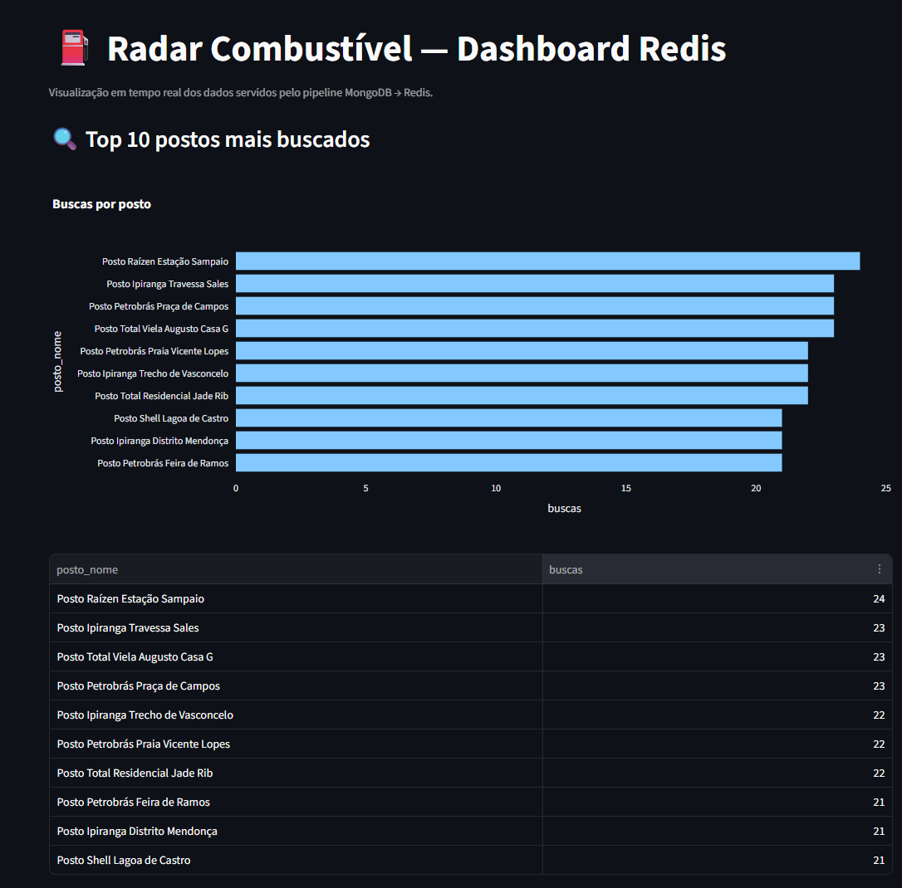
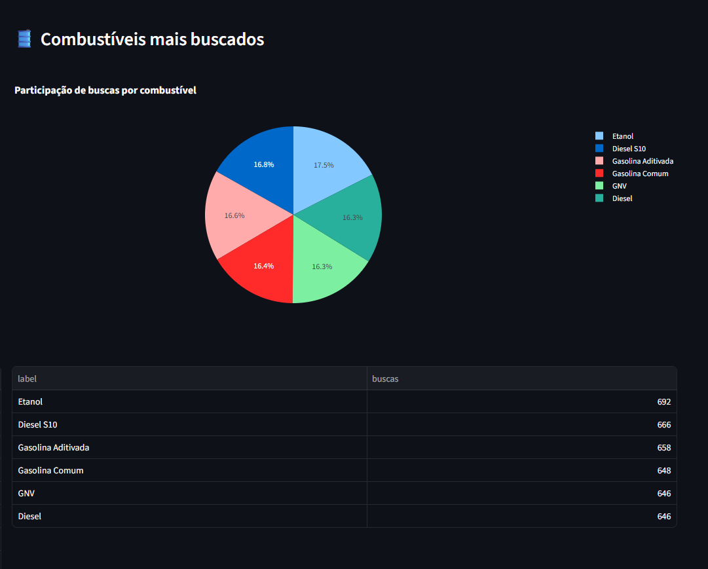
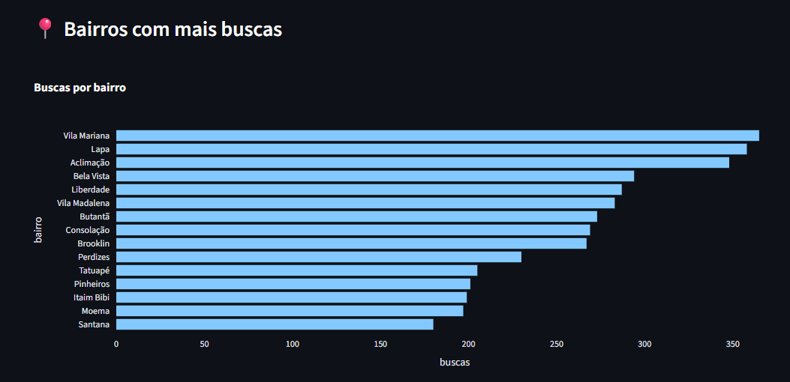
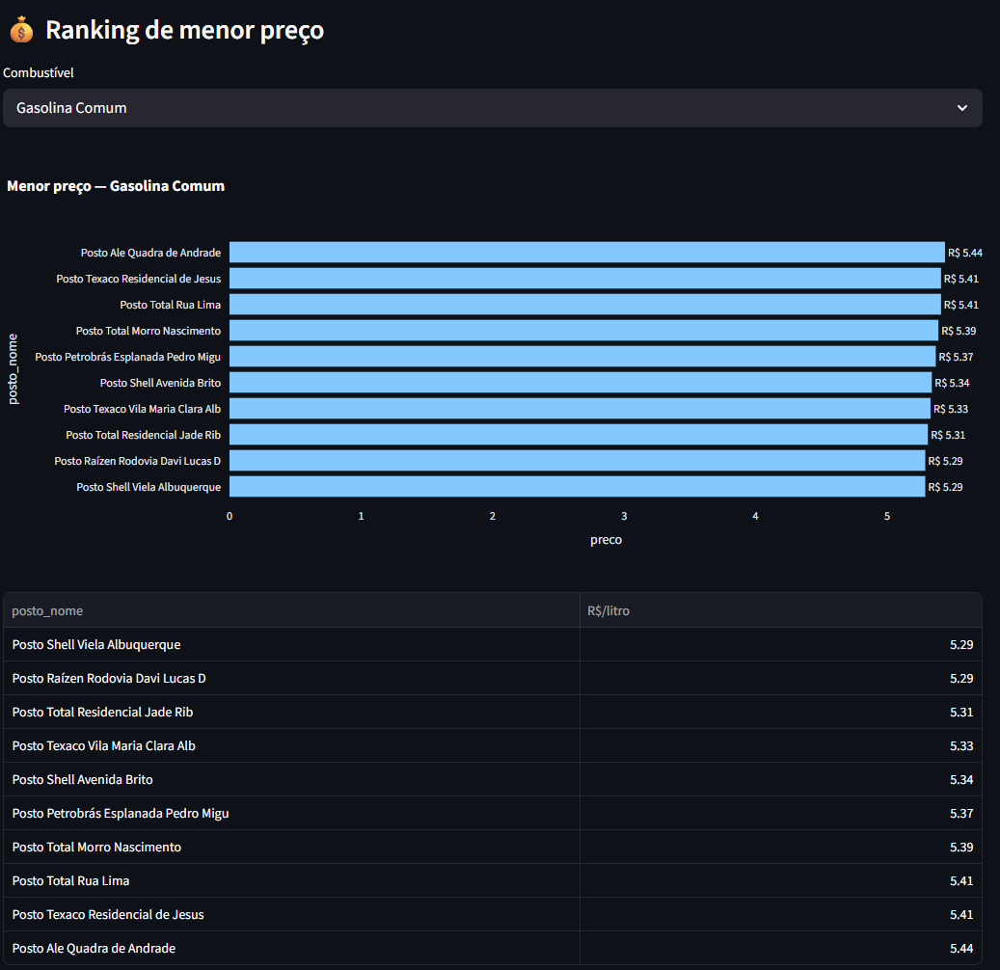
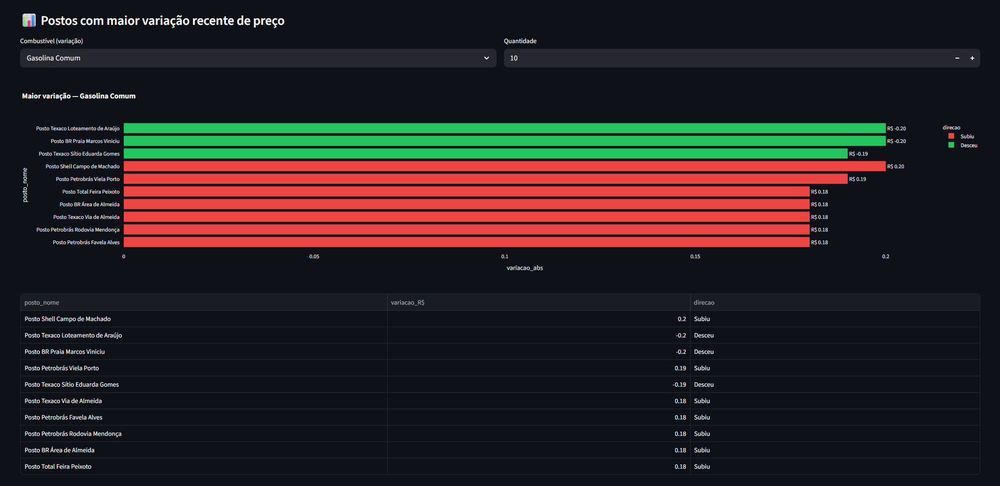
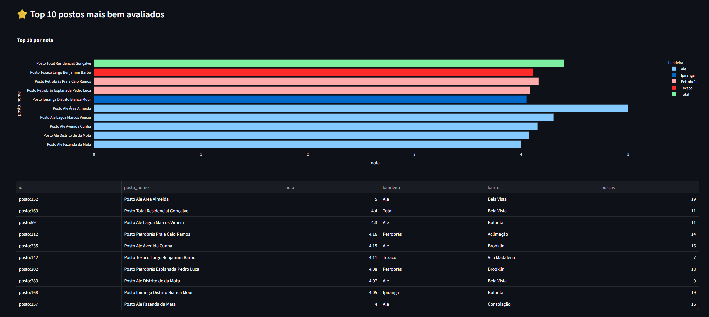
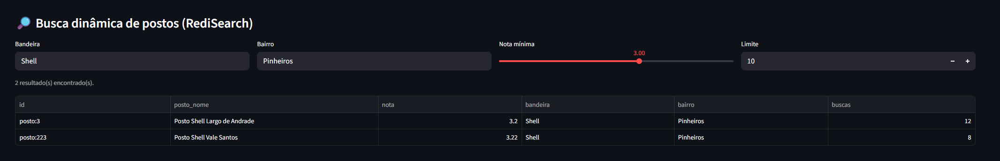
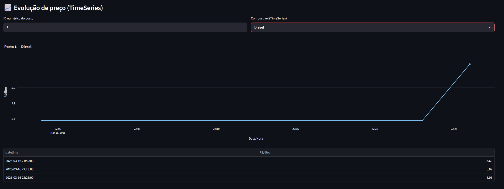

# Trabalho Final — Pipeline MongoDB -> Redis

## Caso: Plataforma Radar Combustivel

**Disciplina:** Bancos de Dados In-Memory | FIAP MBA em Tecnologia

---

## 1. Capa

**Projeto:** Radar Combustivel — Pipeline de dados em tempo quase real

**Disciplina:** Bancos de Dados In-Memory

**Professor:** Daniel Lemeszenski

**Data de entrega:** Marco de 2026

---

## 2. Integrantes

| Nome | RM |
|------|-----|
| Joao Bamberg | RM 361563 |
| Karine Cruz | RM 361697 |
| Lucas Almeida | RM 363849 |
| Joao Cruz | RM 361585 |
| Gabriel Baradel | RM 363699 |

---

## 3. Descricao do problema

### O caso Radar Combustivel

A plataforma **Radar Combustivel** acompanha informacoes de postos de combustivel, precos, localizacao e interacoes dos usuarios na cidade de Sao Paulo. Os usuarios buscam postos por bairro, combustivel e proximidade, enquanto os postos atualizam seus precos em tempo real.

### Problema de negocio

O desafio e transformar o alto volume de eventos (buscas, atualizacoes de preco, abastecimentos e avaliacoes) em uma **camada de consulta rapida** capaz de responder, em tempo real:

- **Quais postos estao com menor preco** por tipo de combustivel?
- **Quais combustiveis estao em alta** (mais buscados)?
- **Quais bairros** apresentam maior volume de buscas?
- **Quais postos tiveram maior variacao recente de preco?**
- **Como o preco evoluiu ao longo do tempo** em um determinado posto?
- **Quais postos sao mais populares** (mais buscados e abastecidos)?
- **Quais postos tem melhor avaliacao?**

### Modelagem do caso

O projeto modela 4 entidades/eventos principais:

| Entidade/Evento | Descricao |
|-----------------|-----------|
| **Postos** | 300 postos de combustivel em Sao Paulo, com bandeira (Shell, BR, Ipiranga, etc.), bairro e coordenadas geograficas |
| **Eventos de busca** | Usuarios buscando postos — gera rankings de popularidade por posto, bairro e combustivel |
| **Atualizacoes de preco** | Postos atualizando precos de 6 tipos de combustivel — alimenta rankings de menor preco e series temporais |
| **Abastecimentos e avaliacoes** | Usuarios registrando abastecimentos e notas — gera rankings de frequencia e avaliacao |

### Combustiveis modelados

| Combustivel | Faixa de preco (R$/litro) |
|-------------|--------------------------|
| Gasolina Comum | R$ 5,49 — R$ 6,59 |
| Gasolina Aditivada | R$ 5,89 — R$ 6,99 |
| Etanol | R$ 3,49 — R$ 4,59 |
| Diesel | R$ 5,79 — R$ 6,89 |
| Diesel S10 | R$ 5,99 — R$ 7,09 |
| GNV | R$ 3,79 — R$ 4,89/m3 |

---

## 4. Arquitetura da solucao

### Diagrama da arquitetura

```
+-------------------------------------------------------------+
|                    CAMADA DE ORIGEM                          |
|  Usuarios/Postos --> MongoDB (eventos brutos)                |
|  Database: radar_combustivel | Collection: eventos           |
+-----------------------------+-------------------------------+
                              |
                              | Change Stream (oplog)
                              v
+-------------------------------------------------------------+
|              PIPELINE PYTHON (Consumer)                      |
|  mongodb_consumer.py + event_transformer.py                  |
|                                                              |
|  1. Le Change Stream do MongoDB (inserts)                    |
|  2. Normaliza evento (tipo, timestamp, preco, coordenadas)   |
|  3. Aplica transformacoes por tipo de evento                 |
|  4. Escreve nas estruturas Redis adequadas                   |
+-----------------------------+-------------------------------+
                              |
          +-------------------+-------------------+
          |                   |                   |
          v                   v                   v
   +--------------+   +--------------+   +--------------+
   | Sorted Sets  |   |  RediSearch  |   | TimeSeries   |
   | (Rankings)   |   | (Busca+Geo)  |   | (Precos)     |
   +--------------+   +--------------+   +--------------+
   | - menor preco|   | - bandeira   |   | - preco por  |
   | - mais buscas|   | - bairro     |   |   combustivel|
   | - por bairro |   | - nota       |   | - por minuto |
   | - variacao   |   | - GeoField   |   |              |
   +--------------+   +--------------+   +--------------+
          |                   |                   |
          +-------------------+-------------------+
                              |
                              v
+-------------------------------------------------------------+
|              CAMADA DE VISUALIZACAO                          |
|  Streamlit Dashboard (data-view.py)                          |
|  8 paineis interativos — consultas <10ms                     |
+-------------------------------------------------------------+
```

### Fluxo de dados detalhado

1. **Ingestao:** O script `mongo_seed.py` gera dados fake realistas (300 postos, ~24.400 eventos) e insere no MongoDB. Inclui 10.000 eventos gerais (buscas, abastecimentos, avaliacoes) e 14.400 atualizacoes de preco dedicadas (8 por posto/combustivel ao longo de 24h). No modo stress, simula carga continua.

2. **Change Stream:** O MongoDB, configurado como Replica Set (`rs0`), emite eventos via oplog para cada novo insert na collection `eventos`.

3. **Consumer:** O script `mongodb_consumer.py` escuta o Change Stream em tempo real. Para cada evento:
   - Normaliza os dados via `event_transformer.py`
   - Identifica o tipo de evento
   - Aplica as escritas adequadas no Redis

4. **Serving:** O Redis serve como camada de leitura rapida com multiplas estruturas otimizadas para cada tipo de consulta.

5. **Visualizacao:** O dashboard Streamlit le diretamente do Redis e exibe 8 paineis interativos com auto-refresh.

---

## 5. Pipeline MongoDB -> Redis

### Eventos e processamento

Para cada tipo de evento, o pipeline executa diferentes operacoes no Redis:

#### Evento: `busca`
Quando um usuario busca um posto ou combustivel:
```
MongoDB (insert) --> Change Stream --> Consumer
  |
  +--> ZINCRBY ranking:postos:buscas +1 {posto_id}
  +--> ZINCRBY ranking:combustivel:buscas +1 {combustivel}
  +--> ZINCRBY ranking:bairro:buscas +1 {bairro}
  +--> HINCRBY posto:{id} buscas +1
  +--> TS.ADD ts:posto:{id}:buscas {ts} 1
```

#### Evento: `atualizacao_preco`
Quando um posto atualiza o preco de um combustivel:
```
MongoDB (insert) --> Change Stream --> Consumer
  |
  +--> Calcula variacao = preco_novo - preco_anterior
  +--> ZADD ranking:variacao:{combustivel} {|variacao|} {posto_id}
  +--> HSET posto:{id} variacao_{combustivel} {variacao}
  +--> HSET posto:{id} preco_{combustivel} {preco}
  +--> ZADD ranking:preco:{combustivel} {preco} {posto_id}
  +--> TS.ADD ts:posto:{id}:preco:{combustivel} {ts} {preco}
```

#### Evento: `abastecimento`
Quando um usuario registra um abastecimento:
```
MongoDB (insert) --> Change Stream --> Consumer
  |
  +--> ZINCRBY ranking:postos:abastecimentos +1 {posto_id}
  +--> HINCRBY posto:{id} abastecimentos +1
  +--> TS.ADD ts:posto:{id}:abastecimentos {ts} 1
```

#### Evento: `avaliacao`
Quando um usuario avalia um posto:
```
MongoDB (insert) --> Change Stream --> Consumer
  |
  +--> HINCRBYFLOAT posto:{id} nota_sum {nota}
  +--> HINCRBY posto:{id} nota_count +1
  +--> Calcula media = nota_sum / nota_count
  +--> HSET posto:{id} nota {media}
```

### Resiliencia

O consumer roda em loop infinito com reconexao automatica. Se o Change Stream falhar (queda de rede, reinicio do MongoDB), o pipeline:
1. Captura a excecao
2. Aguarda 2 segundos
3. Reconecta ao Change Stream automaticamente

O backfill inicial processa todos os eventos existentes antes de entrar em modo streaming, garantindo que o Redis tenha dados mesmo apos um restart.

---

## 6. Estruturas Redis utilizadas

### 6.1 Hashes — Cadastro de postos

**Chave:** `posto:{id}`

Armazena os metadados completos de cada posto com acesso O(1) a qualquer campo individual.

```
HGETALL posto:45
 1) "posto_id"          -> "posto_45"
 2) "posto_nome"        -> "Posto Shell Pinheiros"
 3) "bandeira"          -> "Shell"
 4) "bairro"            -> "Pinheiros"
 5) "cidade"            -> "Sao Paulo"
 6) "location"          -> "-46.6333,-23.5505"
 7) "nota"              -> "4.35"
 8) "buscas"            -> "142"
 9) "abastecimentos"    -> "38"
10) "preco_gasolina_comum" -> "5.89"
11) "preco_etanol"      -> "3.79"
12) "variacao_gasolina_comum" -> "0.15"
```

**Justificativa:** Hashes sao ideais para agrupar multiplos atributos de uma entidade com acesso O(1). Permitem atualizar campos individuais (HINCRBY, HSET) sem reescrever todo o documento, o que e fundamental para o pipeline que atualiza preco, nota e contadores de forma independente.

---

### 6.2 Sorted Sets — Rankings

**Chaves:**
- `ranking:postos:buscas` — postos mais buscados
- `ranking:postos:abastecimentos` — postos mais frequentados
- `ranking:combustivel:buscas` — combustiveis mais procurados
- `ranking:bairro:buscas` — bairros com mais demanda
- `ranking:preco:{combustivel}` — postos com menor preco
- `ranking:variacao:{combustivel}` — postos com maior variacao de preco

```
# Top 5 postos mais buscados
ZREVRANGE ranking:postos:buscas 0 4 WITHSCORES

# Top 5 menor preco de gasolina
ZRANGE ranking:preco:gasolina_comum 0 4 WITHSCORES

# Top 5 maior variacao de preco
ZREVRANGE ranking:variacao:gasolina_comum 0 4 WITHSCORES
```

**Justificativa:** Sorted Sets oferecem:
- **ZINCRBY atomico** — incrementa contadores sem race conditions
- **ZRANGE/ZREVRANGE em O(log N)** — retorna top-N ordenado instantaneamente
- **ZADD com score = preco** — para rankings de menor preco, o Redis ja ordena naturalmente do menor para o maior
- Cada tipo de ranking usa um Sorted Set separado, seguindo a modelagem orientada a acesso

---

### 6.3 RediSearch — Busca avancada com filtros

**Indice:** `idx:postos` (prefixo `posto:*`)

```
FT.SEARCH idx:postos
  "@bandeira:{Shell} @bairro:{Pinheiros} @nota:[4.0 5]"
  SORTBY buscas DESC
  LIMIT 0 10
```

**Campos indexados:**
| Campo | Tipo | Uso |
|-------|------|-----|
| `posto_nome` | TextField (peso 2.0) | Busca por nome |
| `bandeira` | TagField | Filtro exato por bandeira |
| `bairro` | TagField | Filtro exato por bairro |
| `nota` | NumericField (sortable) | Filtro por nota minima |
| `buscas` | NumericField (sortable) | Ordenacao por popularidade |
| `preco_gasolina_comum` | NumericField (sortable) | Filtro por faixa de preco |
| `preco_etanol` | NumericField (sortable) | Filtro por faixa de preco |
| `preco_diesel` | NumericField (sortable) | Filtro por faixa de preco |
| `location` | GeoField | Consulta por proximidade |

**Justificativa:** RediSearch permite combinar filtros de texto, tags, numeros e geolocalizacao em uma unica query com latencia <10ms. E a escolha natural para buscas dinamicas onde o usuario seleciona multiplos criterios simultaneamente (bandeira + bairro + nota minima).

---

### 6.4 TimeSeries — Evolucao de precos

**Chaves:** `ts:posto:{id}:preco:{combustivel}`

```
# Evolucao de preco por minuto
TS.RANGE ts:posto:45:preco:gasolina_comum - +
  AGGREGATION last 60000

# Resultado:
1) 1710010200000 -> 5.89
2) 1710010260000 -> 5.92
3) 1710010320000 -> 5.85
```

**Configuracao:**
- **Retencao:** 7 dias (604.800.000 ms)
- **Politica de duplicatas:** LAST (mantem o valor mais recente)
- **Labels:** posto_id, metric, combustivel (para filtros)

**Justificativa:** RedisTimeSeries oferece:
- **Agregacao nativa por janela** (por minuto, hora, dia) sem logica aplicacional
- **Retencao automatica** — dados expiram apos 7 dias, evitando crescimento infinito
- **Compressao temporal** — armazena apenas pontos relevantes
- Ideal para responder "como o preco evoluiu?" com um unico comando

---

### 6.5 Geo (via GeoField no RediSearch)

O campo `location` no indice `idx:postos` armazena coordenadas no formato `longitude,latitude`, permitindo consultas por proximidade:

```
FT.SEARCH idx:postos "@location:[-46.6333 -23.5505 5 km]"
```

**Justificativa:** Aproveita o mesmo indice RediSearch para consultas geograficas, evitando uma estrutura separada. Permite responder "quais postos estao perto de mim?" diretamente.

---

### Resumo das estruturas

| Estrutura | Quantidade de chaves | Consulta principal | Complexidade |
|-----------|---------------------|-------------------|--------------|
| Hash | 300 (1 por posto) | Dados do posto | O(1) |
| Sorted Set | ~14 rankings | Top-N, menor preco | O(log N) |
| RediSearch | 1 indice | Busca multi-filtro + geo | <10ms |
| TimeSeries | ~2400 series | Evolucao de preco | O(M) |

---

## 7. Visualizacoes e resultados

O dashboard Streamlit (`queries/data-view.py`) apresenta 8 paineis interativos com auto-refresh configuravel:

### Painel 1: Top 10 postos mais buscados
Grafico de barras horizontal mostrando os postos com maior volume de buscas.
- **Fonte Redis:** `ZREVRANGE ranking:postos:buscas 0 9 WITHSCORES`
- **Valor:** Identifica quais postos tem mais demanda



### Painel 2: Combustiveis mais buscados
Grafico de pizza mostrando a participacao de cada combustivel nas buscas.
- **Fonte Redis:** `ZREVRANGE ranking:combustivel:buscas 0 5 WITHSCORES`
- **Valor:** Mostra quais combustiveis estao "em alta"



### Painel 3: Bairros com mais buscas
Grafico de barras mostrando os bairros com maior volume de buscas.
- **Fonte Redis:** `ZREVRANGE ranking:bairro:buscas 0 14 WITHSCORES`
- **Valor:** Identifica regioes com maior demanda por combustivel



### Painel 4: Ranking de menor preco
Grafico de barras com os postos com menor preco para o combustivel selecionado.
- **Fonte Redis:** `ZRANGE ranking:preco:{combustivel} 0 9 WITHSCORES`
- **Valor:** Responde diretamente "onde abastecer mais barato?"



### Painel 5: Postos com maior variacao de preco
Grafico de barras colorido (vermelho = subiu, verde = desceu) mostrando os postos com maior variacao recente.
- **Fonte Redis:** `ZREVRANGE ranking:variacao:{combustivel} 0 9 WITHSCORES` + `HGET posto:{id} variacao_{combustivel}`
- **Valor:** Alerta para postos que alteraram preco significativamente



### Painel 6: Top 10 postos mais bem avaliados
Grafico de barras com os postos de melhor nota, colorido por bandeira.
- **Fonte Redis:** `FT.SEARCH idx:postos "*" SORTBY nota DESC LIMIT 0 10`
- **Valor:** Ranking de qualidade percebida pelos usuarios



### Painel 7: Busca dinamica (RediSearch)
Formulario interativo com filtros de bandeira, bairro e nota minima.
- **Fonte Redis:** `FT.SEARCH idx:postos "@bandeira:{X} @bairro:{Y} @nota:[Z 5]"`
- **Valor:** Permite consulta personalizada em <10ms



### Painel 8: Evolucao de preco (TimeSeries)
Grafico de linha mostrando a variacao de preco ao longo do tempo para um posto e combustivel selecionados.
- **Fonte Redis:** `TS.RANGE ts:posto:{id}:preco:{combustivel} - + AGGREGATION last 60000`
- **Valor:** Visualiza tendencia de preco



---

## 8. Conclusao

O projeto Radar Combustivel demonstra a construcao de um pipeline completo de dados em tempo quase real, desde a ingestao de eventos no MongoDB ate a camada de serving no Redis, com visualizacao via Streamlit.

### Principais entregas:

1. **Modelagem orientada a acesso** — cada estrutura Redis foi escolhida para responder uma pergunta de negocio especifica, e nao para replicar o modelo documental do MongoDB.

2. **Pipeline orientado a eventos** — o MongoDB Change Stream captura inserts em tempo real, sem polling, com reconexao automatica em caso de falha.

3. **5 tipos de estruturas Redis** — Hashes, Sorted Sets, RediSearch, TimeSeries e Geo, cada um com justificativa tecnica clara.

4. **8 paineis de visualizacao** — dashboard interativo que demonstra o valor pratico da camada de serving.

5. **Diferenciais implementados:**
   - Consultas geograficas (GeoField)
   - Series temporais de preco (TimeSeries)
   - Rankings por bairro, cidade e combustivel
   - Variacao de preco (deteccao de mudanca)
   - Interface com multiplas visoes
   - Tratamento de falhas (reconexao automatica)

### Aprendizados:

- A separacao entre camada transacional (MongoDB) e camada de serving (Redis) permite consultas em <10ms sem impactar a base operacional.
- A modelagem orientada a consulta exige pensar primeiro "que perguntas preciso responder?" antes de definir as estruturas.
- Sorted Sets com ZINCRBY sao ideais para rankings incrementais em tempo real.
- TimeSeries e a escolha natural para dados temporais com agregacao, evitando processamento na aplicacao.

---

## 9. Link do GitHub

**Repositorio:** https://github.com/commithouse/lab-streaming-mongo-redis

### Como executar:

```bash
# 1. Clonar repositorio
git clone https://github.com/commithouse/lab-streaming-mongo-redis.git
cd lab-streaming-mongo-redis

# 2. Configurar ambiente
cp .env.example .env

# 3. Subir infraestrutura
docker-compose up -d

# 4. Instalar dependencias
pip install -r requirements.txt

# 5. Popular MongoDB (300 postos, ~24K eventos)
python init/mongo_seed.py

# 6. Criar indices Redis
python init/redis_indexes.py

# 7. Iniciar consumer (Terminal 1)
python pipeline/mongodb_consumer.py

# 8. Abrir dashboard (Terminal 2)
python -m streamlit run queries/data-view.py

# 9. Simular carga (Terminal 3 — opcional)
python init/mongo_seed.py --stress --events 1000
```

**Dashboard:** http://localhost:8501

---

*Trabalho Final — Bancos de Dados In-Memory — FIAP MBA em Tecnologia — Marco 2026*
